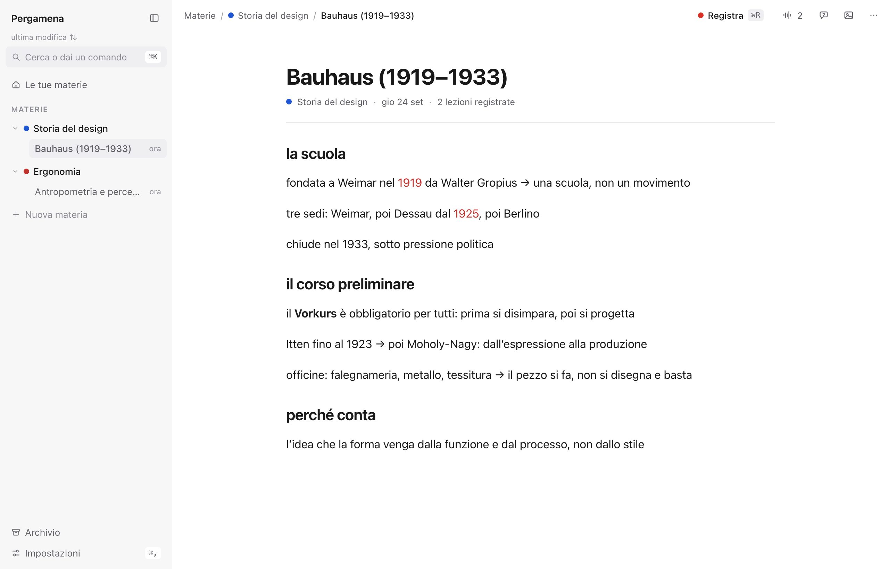
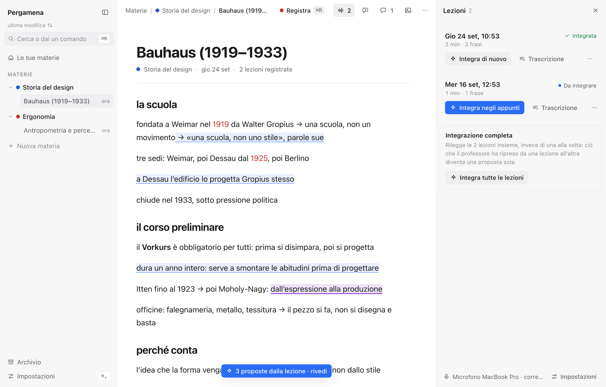
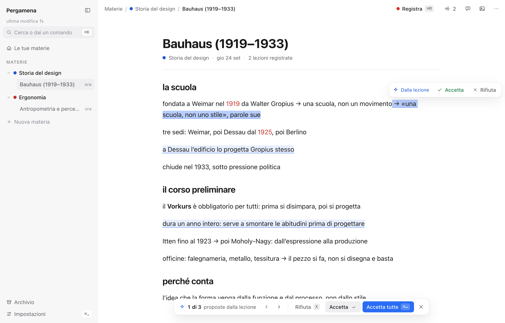
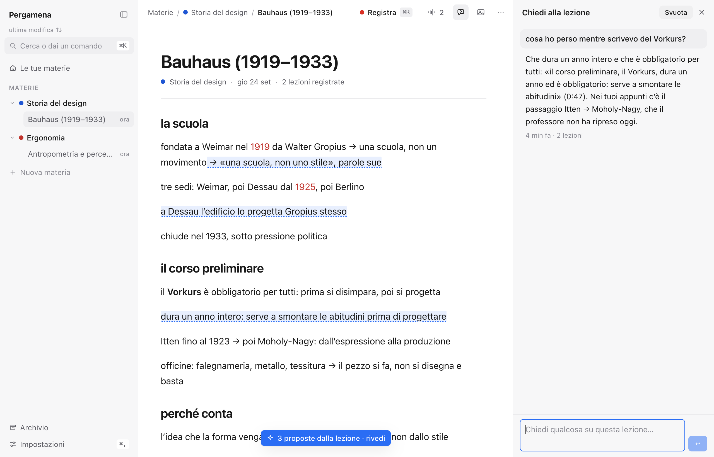
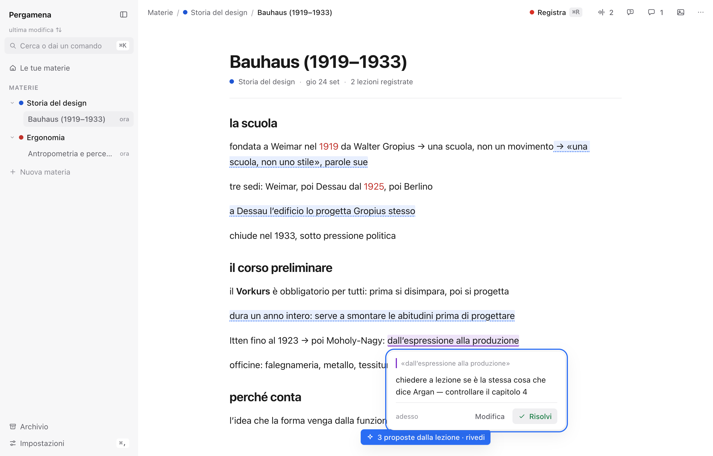

# Pergamena


Un quaderno per gli appunti a lezione. Scrivi mentre il professore parla;
Pergamena ascolta, trascrive **sul Mac** e poi ti aiuta a completare quello
che non hai fatto in tempo a scrivere — senza riscrivere quello che hai
scritto tu.

Non è un clone di Notion: è pensato per una cosa sola, prendere appunti a
lezione e ritrovarli buoni un mese dopo. Regge molte ore di lezione a
settimana: ogni funzione che costa (trascrizione, modelli) è fatta per
girare tutti i giorni senza diventare un abbonamento.



---

## Cosa fa

### Scrivere, senza attrezzi in mezzo

Nessuna barra degli strumenti: gli strumenti arrivano quando servono.
Selezioni del testo e compare il menu (grassetto, corsivo, titoli, cinque
colori, evidenziatore, «Quiz» su quel passaggio, «Commenta»). Su una riga
vuota, `/` apre l'elenco dei blocchi. A sinistra di ogni riga c'è una
maniglia per trascinarla, e `⌘⇧↑` / `⌘⇧↓` la spostano da tastiera.

Dentro: titoli, elenchi (anche annidati), citazioni, codice, immagini,
formule LaTeX (`$$E=mc^2$$` nel testo, `$$$…$$$` su una riga da sola,
disegnate da KaTeX), e le frecce che si scrivono da sole (`->` → `→`).

### Registrare la lezione, e trascriverla sul Mac

Premi **Registra** (`⌘R`) e Pergamena ascolta il microfono. La
trascrizione la fa `SpeechTranscriber` di macOS, **sul tuo computer**:
l'audio non esce dal Mac e non passa da nessun servizio.

Mentre registra, in fondo al foglio scorre una fascia con le ultime frasi
sentite — serve a capire a colpo d'occhio che sta sentendo *te* e non il
ventilatore. Se per sei secondi non arriva niente lo dice, perché il
microfono «di sistema» può essere un dispositivo virtuale che non sente
l'aula. Si può mettere in pausa, scegliere un altro microfono, e tenere
anche l'audio (~17 MB l'ora, spento di partenza).

Se ricarichi la pagina o il Mac va in stop, la registrazione non si
perde: la pagina si ricollega e riprende le frasi arrivate nel frattempo.


*Ogni lezione tiene la sua trascrizione, si riascolta dal minuto che clicchi (se hai tenuto l'audio) e si può togliere insieme a tutto quello che ha prodotto.*

### Completare gli appunti dopo la lezione

È la funzione per cui esiste il progetto. A lezione finita, **Integra
negli appunti**: il modello confronta quello che hai scritto con quello
che è stato detto e propone le aggiunte — una per una, da accettare (`↵`)
o rifiutare (`X`), con `J` e `K` per scorrerle.

Tre regole che cambiano tutto:

- **non riscrive i tuoi appunti.** Se la tua riga esiste già ma è monca,
  la *completa* — attacca il pezzo mancante in fondo o nel punto giusto,
  come se avessi continuato tu. Apre una riga nuova solo quando di quella
  cosa non c'era traccia;
- **scrive come scrivi tu.** Prima di chiedere, misura la tua pagina:
  lunghezza delle righe, minuscole a inizio riga, punto finale o no,
  simboli che usi, grassetto e colori. Le proposte arrivano con la tua
  forma, non con quella del modello;
- **si vede sempre cosa non è tuo.** Il testo proposto è sottolineato a
  puntini e resta riconoscibile anche dopo che l'hai accettato.


*Le proposte si scorrono con `J` e `K`, si accettano con `↵`, si rifiutano con `X`. Quella in alto è un completamento: cresce in fondo a una riga già scritta.*

Sa anche proporre i **titoli** degli argomenti che mancano, scrivere
**formule** in LaTeX quando il professore ne ha dettata una, e suggerire
**immagini** per i concetti che ne meritano una.

Con più lezioni sulla stessa pagina c'è **Integrazione completa**: le
legge tutte insieme in una chiamata sola, così un dato ripreso a distanza
di settimane diventa una proposta sola e una precisazione fatta dopo
vince su quella di prima.

### Correggere mentre sei ancora in aula

Se scrivi una data, un numero o un nome che non torna con quello che è
appena stato detto, compare un pallino nel margine: `⌥⌘↓` apre la scheda
con la citazione del professore e il cambio proposto. `↵` corregge, `X`
lascia com'era.

Si controllano solo le righe con qualcosa di **verificabile** — un
numero, un nome, un buco lasciato per dopo — al massimo una volta ogni
dieci secondi, e solo contro gli ultimi novanta secondi di lezione. È
quello che tiene bassi i costi e le interruzioni: una riga di soli
concetti non viene nemmeno guardata.

### Chiedere alla lezione

Una domanda sulla pagina, e risponde leggendo **due sole fonti**: i tuoi
appunti e la trascrizione. «Cosa ho perso mentre scrivevo?», «su cosa ha
insistito?», «riassumimi la lezione in cinque punti».



Cita il professore fra virgolette col minuto — «(0:42)» — e distingue
quello che ha detto lui da quello che avevi già scritto. Se la risposta
non c'è, lo dice invece di inventarla. Le domande restano nella pagina:
quella che ti sei fatto a ottobre è ancora lì a gennaio.

### Commentare parole e frasi

Selezioni, `⌘⇧M`, scrivi: il pezzo resta segnato in viola e cliccandolo
si rilegge la nota. Un pannello elenca tutti i commenti della pagina
nell'ordine in cui stanno nel testo.

Se cancelli la frase commentata il commento non sparisce in silenzio:
resta in fondo all'elenco con la citazione di com'era.



### Immagini

Un pannello cerca immagini e le trascini dove vuoi; `!Basilica di
Superga!` fa partire la ricerca mentre scrivi. Ogni ricerca passa prima
da Wikipedia, che risolve la parola e dà quasi sempre l'immagine giusta —
e in regalo il termine inglese per Commons e Openverse, che sono
catalogati quasi solo in inglese. Con una chiave di Serper arrivano
anche i risultati di Google Immagini.

Le immagini inserite restano sul tuo computer, con autore e licenza
scritti sotto.

### Ripassare

Ogni titolo 1 apre un **argomento**. La scheda di una materia mette in
fila gli argomenti, «dove eravamo rimasti» (il punto sulle ultime due
lezioni) e i **quiz**: domande generate dai tuoi appunti e dalla lezione,
con «rileggi negli appunti» che riporta al punto esatto.

L'**archivio** dice quanto occupa cosa — pagine, trascrizioni, audio,
immagini — e permette di togliere quello che non serve più.

### Il telefono, e la sincronia

Se colleghi un progetto Supabase (tuo), le pagine si sincronizzano fra
Mac e telefono. Sul telefono si **legge**: stessa resa, stessi blocchi,
niente da configurare. Senza Supabase, Pergamena resta un'app locale e
funziona uguale.

### Farla tua

- **Scorciatoie** (Impostazioni › Tastiera): ogni combinazione si
  ri-registra premendo i tasti nuovi, e quelle già prese non si rubano.
- **Istruzioni dell'integratore** (Impostazioni › Integratore): il testo
  che il modello legge prima dei tuoi appunti è un campo, non una
  costante nel codice. «Niente definizioni», «solo numeri e date»,
  «scrivi in inglese».
- **Chiavi** (Impostazioni › Chiavi), tema, microfono, fonte delle
  immagini, correzioni in diretta accese o spente.

---

## Cosa serve

- **un Mac con macOS 26**: la trascrizione usa `SpeechTranscriber` di
  sistema. Senza, tutto il resto funziona lo stesso: non registra;
- **Node 24** (`nvm use` legge `.nvmrc`);
- gli **strumenti da riga di comando di Xcode**, una volta sola, per
  compilare il programmino che ascolta il microfono
  (`xcode-select --install`);
- una **chiave di OpenRouter** per le parti con l'AI. Tutto il resto —
  scrivere, registrare, trascrivere, immagini, archivio — funziona senza.

## Installazione

```bash
git clone https://github.com/TCdesign-dev/Pergamena.git
cd Pergamena
nvm use            # Node 24: Vite 8 non gira sul 20 di sistema
npm install
npm run dev        # http://localhost:5180
```

Il primo `npm run dev` compila da solo il programma che ascolta
(`nativo/ascolto/compila.sh`); la prima volta che premi **Registra**,
macOS chiede il permesso per il microfono.

`npm run check` per il controllo dei tipi.

## Le chiavi

Due strade, e la prima non chiede di aprire nessun file:

1. **Dalle Impostazioni** (`⌘,`) › **Chiavi**: incolli la chiave di
   OpenRouter e l'app funziona. Resta su quel computer, in
   `localStorage`, e viaggia solo al server locale — che è l'unico che
   parla con OpenRouter. C'è anche «Prova», che dice subito se la chiave
   è buona.
2. **In un file `.env.local`**, copiando [`.env.example`](.env.example):
   sta fuori dal browser, ed è il posto più sicuro dei due. Se c'è, vince.

| chiave | serve a | senza |
|---|---|---|
| `OPENROUTER_API_KEY` | integratore, domande, quiz, correzioni | l'app scrive e registra, ma non integra |
| `VITE_SUPABASE_URL` + `VITE_SUPABASE_ANON_KEY` | sincronia fra Mac e telefono | tutto resta su questo computer |
| `SERPER_API_KEY` | immagini da Google | immagini da Wikipedia, Commons e Openverse |

I modelli si scelgono dal `.env.local` (`MODELLO_MERGE` e compagnia):
cambiarli non tocca il codice.

## Quanto costa

Poco, ed è una scelta di progetto: il modello si chiama una volta per
lezione (l'integratore), e le correzioni in diretta passano prima da un
filtro che costa una frazione di centesimo a riga. Nell'ordine di qualche
decina di centesimi al mese anche con molte ore di lezione a settimana.

La trascrizione è gratis perché gira sul Mac. Le immagini sono gratis
finché bastano Wikipedia, Commons e Openverse.

## Dove finiscono i tuoi appunti

Sul tuo computer: IndexedDB per il testo, una cartella per gli audio
(`~/Library/Application Support/Pergamena`). Su internet va solo quello
che decidi tu: le pagine, se configuri Supabase — che è un tuo account,
non di qualcun altro — e i pezzi di trascrizione che servono
all'integratore, quando lo lanci, verso il modello che hai scelto.
Nessuna telemetria, nessun account per usarlo.

---

## Come è fatto

React + TypeScript + Vite. L'editor è TipTap (ProseMirror); il documento
è un `Y.Doc` di Yjs, salvato in IndexedDB e — se configurato —
sincronizzato via Supabase. Niente Tailwind, niente librerie di
componenti: CSS Modules e un file di token.

Il server di sviluppo di Vite fa anche da server dell'app: quattro
plugin in `server/` espongono l'ascolto del microfono, il proxy verso i
modelli, le decisioni del filtro e la ricerca delle immagini. Le chiavi
restano lì e non entrano mai nel browser.

```
src/
├── editor/          l'editor: estensioni TipTap, menu, formule, immagini
├── documento/       Yjs + IndexedDB: quaderni, pagine, archivio
├── registrazione/   microfono, trascrizione, pannello delle lezioni
├── merge/           l'integratore: prompt, proposte, revisione
├── correzioni/      le correzioni in diretta, dal triage alla scheda
├── domande/         «chiedi alla lezione»
├── commenti/        i commenti sul testo
├── immagini/        Wikipedia, Commons, web, immagini consigliate
├── ripasso/         argomenti, quiz, «dove eravamo rimasti»
├── materia/         la scheda della materia, esami, collegamenti
├── ricerca/         l'indice e la ricerca nel testo
├── sync/            Supabase: accesso e sincronizzazione
├── tastiera/        le scorciatoie, e quelle che hai cambiato
├── telefono/        la vista di sola lettura
├── layout/          guscio, barre, pannelli, impostazioni
├── lib/             modello, decisioni, testo, icone
└── stili/           token, colori, movimento, stile del contenuto

server/              i plugin di Vite: ascolto, llm, decisioni, immagini
nativo/ascolto/      il programma Swift che ascolta e trascrive
supabase/schema.sql  tabella, indici e politiche di accesso
docs/                il quaderno di bordo: perché le cose sono così
```

Le tre decisioni da cui dipende il resto — l'id stabile su ogni blocco,
lo stato dei menu fuori da React, il documento come unica fonte — sono
raccontate nel [quaderno di bordo](docs/quaderno-di-bordo.md), insieme
al perché di tutto il resto: le misure, gli errori presi per strada e le
cose provate e buttate.

## Stato del progetto

In uso tutti i giorni, su lezioni vere, da settembre 2026. Le funzioni
descritte qui ci sono tutte e funzionano; quello che cambia più spesso
sono i prompt, perché è lì che si vede la differenza fra una proposta
utile e una da buttare.

Non è un prodotto: è un progetto personale tenuto in ordine abbastanza
da poter essere letto, copiato e cambiato. Non c'è un installatore, non
c'è un servizio dietro, e la roadmap dipende da cosa serve la settimana
dopo.

## Domande e problemi

Le [issue](https://github.com/TCdesign-dev/Pergamena/issues) sono il
posto giusto: sia per i difetti sia per le domande su come è fatto. Se
qualcosa non parte, aiuta sapere versione di macOS, versione di Node e
cosa dice il terminale dove gira `npm run dev`.

Le pull request sono benvenute. Per un cambiamento grosso conviene
aprire prima una issue: il progetto ha delle scelte di fondo (niente
framework di componenti, il documento come unica fonte, le chiavi che
non entrano nel browser) che è meglio discutere prima di scriverci
sopra del codice.

## Licenza

[MIT](LICENSE) — fanne quello che vuoi, senza garanzie.

---

*In short, in English: Pergamena is a note-taking app for students. You
write during class while it records and transcribes the lecture locally
on your Mac; afterwards it compares your notes with what was actually
said and proposes the missing bits — completing your own lines instead
of rewriting them. It also fact-checks dates and numbers live, answers
questions about the lecture using only your notes and the transcript,
and keeps everything on your computer unless you configure your own
Supabase project. The interface and the documentation are in Italian.*
